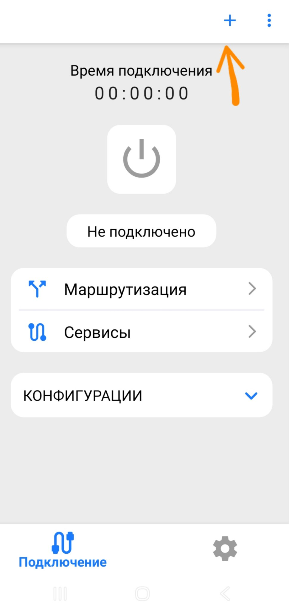
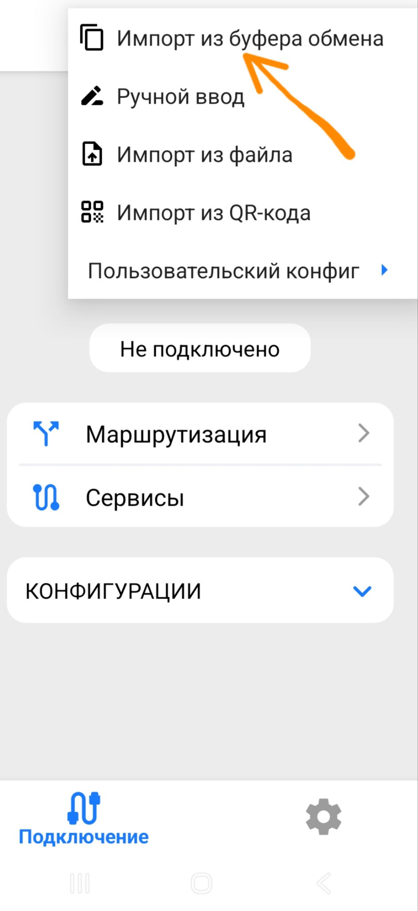
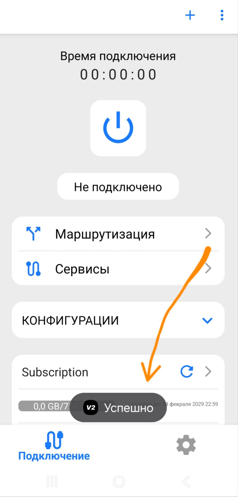
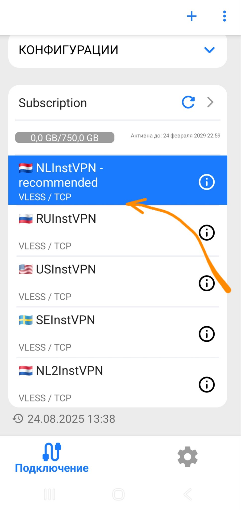
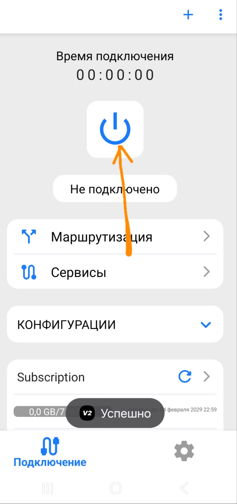
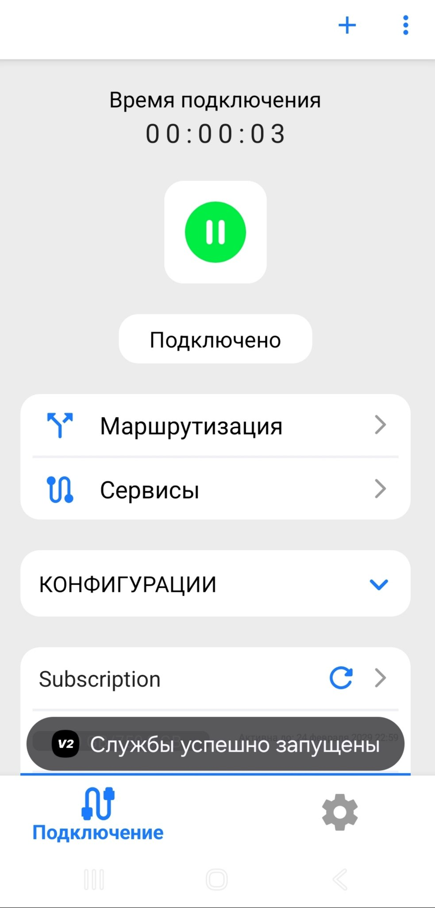

# **Android-v2RayTun**

Август 24, 2025

Установка v2RayTun:

**1. Загрузка приложения:**

Перейдите в Google Play Store: https://play.google.com/store/apps/details?id=com.v2raytun.android

Установите приложение "v2RayTun".

**2. Настройка v2RayTun:**

Запустите приложение v2RayTun.

Скопируйте вашу ссылку для подключения из бота(нажмите кнопку "⚡️ Подключиться!")

Добавление профиля:

Нажмите на значок "+".

Выберите "Добавить из буфера обмена".

Появится новая подписка ниже

Выберите подходящую локацию.

Нажмите кнопку "Подключиться".

Дождитесь изменения статуса на "Подключено".

Вы великолепны! Наслаждайтесь интернетом без ограничений!

Если у вас возникли сложности - пожалуйста напишите в техподдержку. Мы поможем. 
